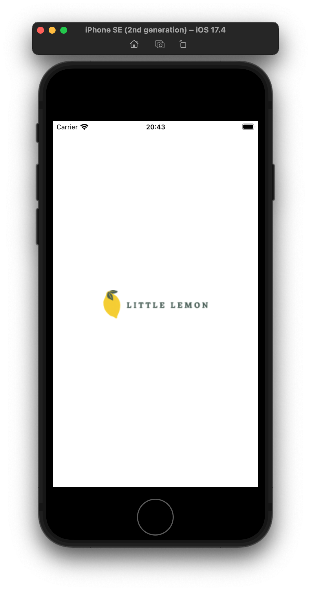
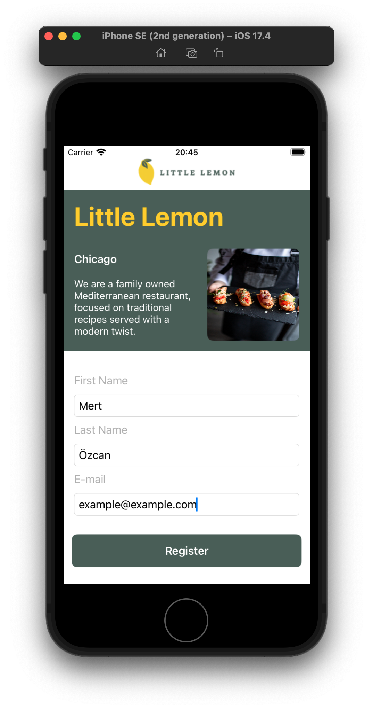
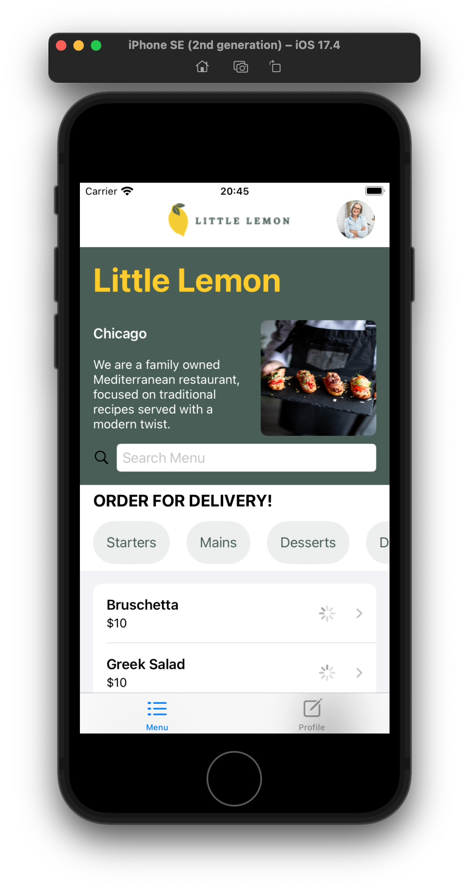
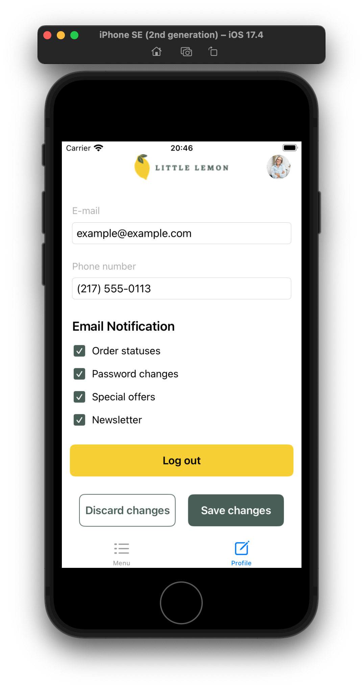

# LittleLemonApp
In this capstone project, you’ll demonstrate your proficiency in iOS development by creating a native iOS app, LittleLemonApp. Throughout this course, I had the opportunity to revisit and repeat the entire iOS application development process from start to finish. This project is designed for intermediate learners looking to solidify their skills and prepare for a career in iOS development. By the end of this course, I have created an interactive mobile application to showcase my development skills to potential employers.

## Objectives
- Build a native iOS mobile app using SwiftUI
- Manage data effectively within an iOS application
- Design and implement a user-friendly interface

## Screenshots

    
    
    
    

